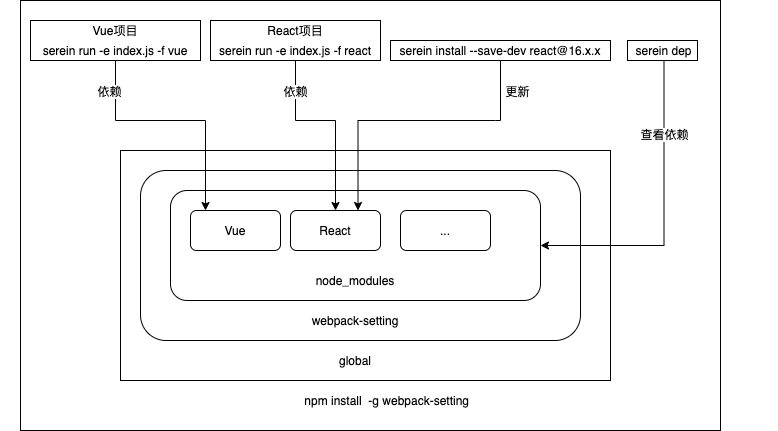

# 介绍

一个帮助你快速搭建 webpack 环境的工具~

## 全局使用

### 全局安装

```bash
npm install -g webpack-setting
```

```bash
yarn global add webpack-setting
```

可以直接使用指令执行对应的文件，无需再次安装项目环境



#### 直接命令行执行指定的入口文件

```bash
serein run -e ./index.js
```

[Example](https://github.com/Dilomen/webpack-setting/tree/master/example/command-vue-demo/index.js)

#### 命令行参数

可通过-h 参数参看

| 简写 | 全称                          | 作用                      |
| ---- | ----------------------------- | ------------------------- |
| -V   | --version                     | 版本号                    |
| -f   | --framework \<framework>      | 选择的框架 react \| vue   |
| -e   | --entry \<file>               | 入口文件路径              |
| -c   | --config \<path> \<framework> | serein.config.js 文件路径 |
| -ts  | --typescript                  | 是否支持 ts               |

#### 直接进行打包任务

```bash
serein run -e ./index.js
```

#### 可以查看当前工具中的依赖及版本

```bash
serein dep
```

#### 也可以指定查看一个依赖的版本号

```bash
serein dep vue
```

#### 可以安装相应的依赖，规则和 npm 一致，只有--save-dev 和--save

```bash
serein install vue
```

```bash
serein install vue --save-dev
```

## 项目内安装

### 安装命令

```bash
npm install webpack-setting
```

```bash
yarn add webpack-setting
```

### 设置 package.json 中的命令，就可以执行命令，进行开发和打包

```js
"scripts": {
    "start": "npm run dev",
    "dev": "serein run",
    "build": "serein build"
}
```

#### 支持对配置文件的路径进行自定义

```js
"dev": "serein run -c ./config/serein.config.js",
"build": "serein build -c ./config/serein.config.js"
```

### 可在根目录下配置自定义的 webpack 配置

为了降低学习成本，及更改配置项的灵活性，将采用 webpack-chain 插件，可以以以下两种方式进行 webpack 配置的修改

- 直接对象 merge 覆盖
- 使用[webpack-chain](https://github.com/Yatoo2018/webpack-chain/tree/zh-cmn-Hans?spm=a2c6h.14275010.0.0.3d7b22efZu5PJT)的方式

需要在根目录下建一个 serein.config.js 的文件

chainWebpack > configureWebpack，即 chainWebpack 在 configureWebpack 之后执行

```js
module.exports = {
  CDNJS: [], // 支持对CDN的加入，不要在根目录建html文件，即可自动化生成带有CDN的html文件
  CDNCSS: [],
  config: {
    framework: 'react', // default: react 暂只支持 react | vue
    ts: false, // default: false
    css: ['less', 'scss'], // default: [] 暂只支持 less | scss
  },
  // 直接返回一个webpack配置对象，该对象会和已有的对象进行合并
  configureWebpack: (config) => {
    if (process.env.NODE_ENV === 'production') {
      return {};
    } else {
      return {};
    }
  },
  // 对已有配置通过webpack-chain的规则进行修改
  chainWebpack: (config) => {
    config.resolve.alias.set('src', './src/');
  },
};
```

### 关于 CDN 的引入

如果使用配置中的 CDN 引入，请不要在根目录下建 html 文件（该项目会根据你的配置生成 html 文件），然后你就可以在开发中直接使用 CDN 的相关内容，不需要再引入 npm 包，从而大大减少项目的体积

#### 对于 svg 文件的处理说明

引入的 svg 图片都会经 url-loader 处理
由于有些插件引入需要将 svg 文件配置为 raw-loader 处理，可采取以下方式引入(加?inline)，这样就会让引入的 svg 文件走 raw-loader 的处理

```js
import ICON from 'icon.svg?inline';
```
